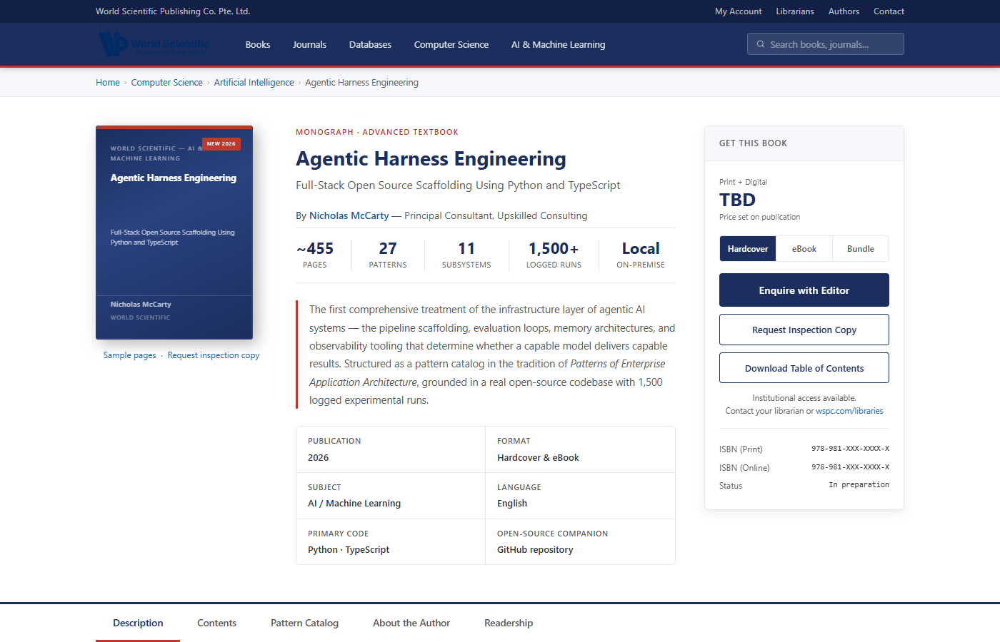
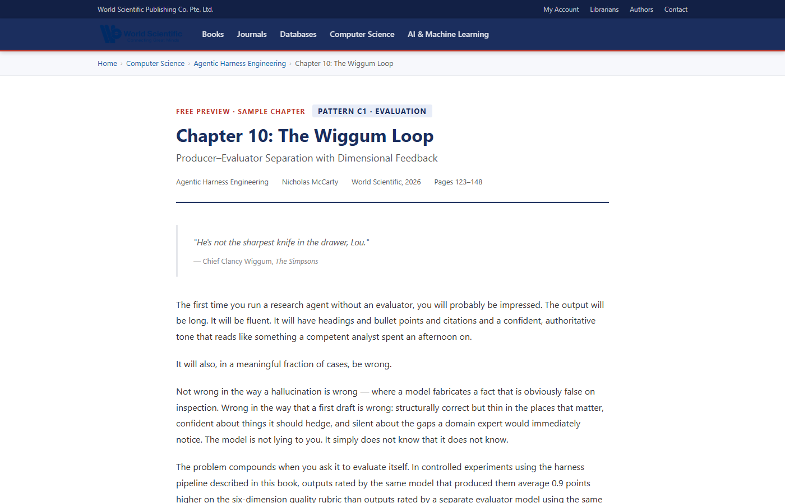

# Agentic Harness Engineering
### Full-Stack Open Source Scaffolding Using Python and TypeScript

**Book proposal submitted to World Scientific Publishing Company (WSPC)**
by Nicholas McCarty, Principal Consultant, Upskilled Consulting

---

**Live proposal site → [nickmccarty.github.io/wspc-book-proposal](https://nickmccarty.github.io/wspc-book-proposal/)**

---

## About the Book

Most books about AI agents focus on prompting techniques or specific frameworks. This one focuses on the **scaffolding** — the harness that sits between your business logic and the LLM API, and that determines whether an agentic system is reliable, observable, and maintainable in production.

*Agentic Harness Engineering* presents 27 named patterns across 22 chapters, organized in the style of Fowler's *Patterns of Enterprise Application Architecture*. Each pattern has a clear intent, a canonical implementation in Python or TypeScript, a failure mode taxonomy, and explicit cross-references to related patterns. The patterns cover the full stack of concerns that practitioners actually face: inference configuration, context engineering, verification loops, multi-agent orchestration, memory architecture, security, observability, and self-improvement.

The book is structured in two parts:

- **Part I — The Landscape** (4 narrative chapters): what a harness is, why the field needs named patterns, the leverage concept, and a guide to reading the catalog.
- **Part II — The Pattern Catalog** (18 chapters, 7 sections): 30 patterns from the Inference Shim to the Self-Improvement Loop.

---

## Proposal Package

| Page | Contents |
|------|----------|
| [Landing page](index.html) | Overview, sample chapter links, coordination-gap diagram |
| [Table of Contents](toc.html) | All 22 chapters with pattern entries and annotations |
| [Introduction](introduction.html) | Full introduction with run-timeline diagram and Prior Art |
| [Chapter 10: The Wiggum Loop](chapter-10-wiggum-loop.html) | Pattern C1 — Producer–Evaluator separation with dimensional feedback |
| [Chapter 14: The Worktree Context](chapter-14-worktree-context.html) | Pattern D2 — Git worktrees as agent state management |
| [Author](author.html) | Bio, CV, and teaching background |

---

## Screenshots

*Landing page — coordination-gap diagram illustrating the core motivation, with links to sample chapters.*

*Chapter 10 — The Wiggum Loop (Pattern C1). D3.js interaction diagram showing the Producer → Evaluator → decision → Revise feedback cycle, with dimensional scoring and persistence logic.*

---

## Sample Chapters

Two full chapters are included in this proposal:

**Chapter 10 — The Wiggum Loop (Pattern C1 · Verification)**
The canonical producer–evaluator pattern, where a separate evaluator scores output along named dimensions, a pass/fail gate decides whether to persist or revise, and revision is targeted to the lowest-scoring dimension. Named for Chief Clancy Wiggum's role as external arbiter. Includes Python implementation, dimensional scoring schema, parameter tuning table, failure mode analysis, and observability instrumentation.

**Chapter 14 — The Worktree Context (Pattern D2 · Orchestration)**
Git worktrees as a mechanism for giving each agent task an isolated working directory without the overhead of separate clones. The pattern enables parallel agent execution, clean rollback, and audit trails as a natural byproduct of normal git operations. Includes TypeScript and Python implementations, comparison with the naive single-clone approach, and integration with CI/CD pipelines.

---

## Prior Art

The outer-loop architecture described in Part I is in direct conversation with **Geoffrey Huntley's [Ralph pattern](https://ghuntley.com/ralph/)** — a bash while-loop that feeds `PROMPT.md` to an LLM CLI, keeps the implementation plan on disk as shared state between isolated context windows, and commits after each iteration. [Clayton Farr's Ralph Playbook](https://claytonfarr.github.io/ralph-playbook/) is a clean operational distillation of that approach.

This book's contribution is what happens *inside* the loop: the harness patterns that determine whether each iteration produces reliable, observable, and composable output. The Wiggum Loop, the Worktree Context, and the Dual-Backend Memory Store are all designed to compose naturally with a Ralph-style outer loop.

---

## Contact

**Nicholas McCarty** · nickmccarty0@gmail.com · [Upskilled Consulting](https://upskilled.consulting)
